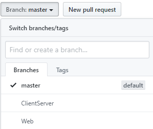

# RestAPI
Panther screens data is returned in a JSON format by which a data table is created.

How to reach different branches, click on Branches on the above table head which will be present on the left.

Need a Panther Web 552 Redhat Image? [Click Here](https://hub.docker.com/r/prolificspanther/pantherweb)

[Click Here](https://www.prolifics.com/panther-trial-license-request) for a 45 day license.

How to setup a Panther Servlet Web Application? [Click Here](https://github.com/ProlificsPanther/PantherWeb/releases)
